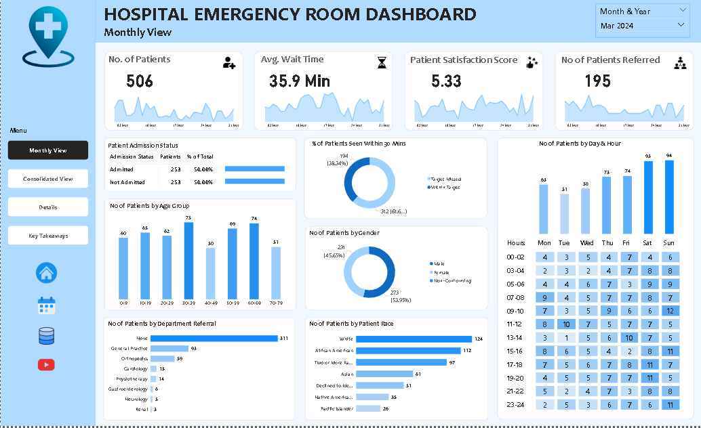

# Hospital-Emergency-Room-Dashboard
This project analyzes Emergency Room (ER) operations using Power BI to improve patient flow, reduce waiting time, and enhance service quality. It includes Monthly, Consolidated, Patient Details, and Key Takeaways dashboards, providing interactive insights for data-driven hospital decision-making.

  

